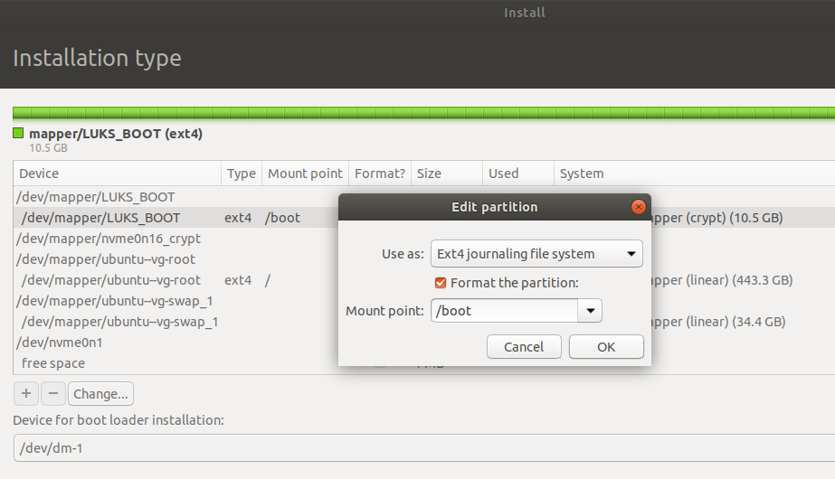
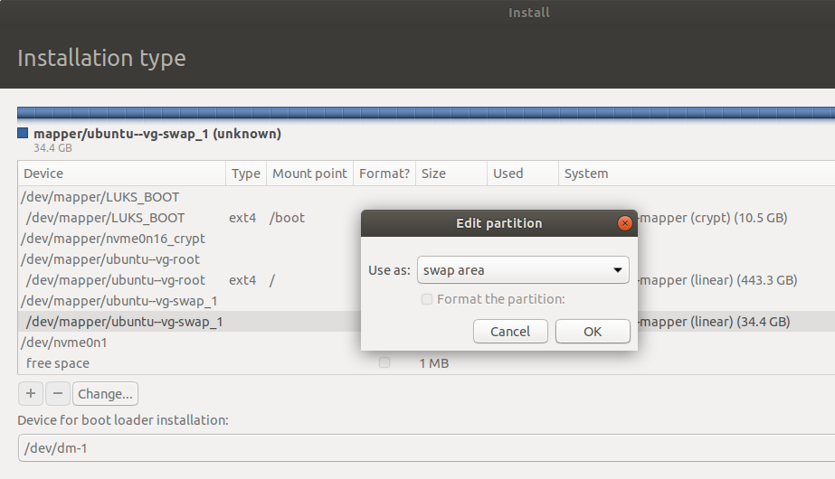
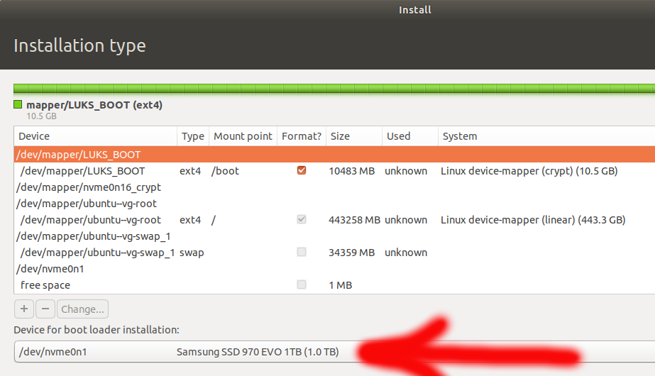

# Installing Ubuntu to an encrypted partition in a dual boot system

This is intended as a quick recommendation/reference for solving the following problem:
- you need to instal an encrypted Ubuntu OS along with a Windows OS. 

The above is the simplest version of the problem. In my case, I had an ssd with a BitLocker encrypted Windows 10 in my laptop and I needed to swap the drive with a larger one and then install an encrypted Ubuntu on the new drive. __Ubuntu 18.04__ is installed to two encripted partitions `/boot` and root `/`. The partitions are encripted with __LUKS__.

I hope you find this reference useful regardless of the variation of the problem that you have. Please fill free to skip some steps if they are not relevant and suggest improvements.

**Note: it is recommended to keep a copy of your hard drive at all times in case you find yourself stuck at some point and decide to do it all over again.**


## 1. Cloning a BitLocker encrypted SSD/NVME/HDD with Windows 10
A bitlocked drive can be quite easy cloned with [Clonezilla](https://clonezilla.org/). They have a [simple guide](https://clonezilla.org/show-live-doc-content.php?topic=clonezilla-live/doc/03_Disk_to_disk_clone) on how to do it. If you follow this guide, you should have an exact clone of your old hard drive even though it has the larger volume and it should work in your system right away. 

At this point, I recommend to unBitLock the newly cloned drive until the end of this installation, where you would BitLock it again. [Method 2 form wikiHow](https://www.wikihow.com/Turn-Off-BitLocker) was how I turned my BitLocker off. __*__ Make sure you wait till the BitLocker screen where you pressed _"Turn Off BitLocker"_ button changes its status from _"Decrypting drive"_ to _"BitLocker Off"_. 

(You probably might just suspend the BitLocker or even do nothing about it, however I did not test this case. Anyways, make sure you back up your recovery key before proceeding. If you do not turn the BitLocker off, you will definitely need the recovery key!)


## 2. Changing SATA mode to AHCI

Your SATA mode can be checked in BIOS. Also, if you try installing Ubuntu but are not seeing your hard drive and/or its partitions, this might be a sign that you need to set your SATA mode to _AHCI_.

Feel free to skip this step if your SATA mode is set to AHCI.


1. Open Windows Registry Editor: press the Win+R to open Run, type regedit, and click OK to open Registry Editor

2. Navigate to: `HKEY_LOCAL_MACHINE\SYSTEM\CurrentControlSet\Services\iaStorV`

    *  Click on _iaStorV_ and make sure that `Start` DWORD on the right part of the screen is 0 (zero)

3. Navigate to: `HKEY_LOCAL_MACHINE\SYSTEM\CurrentControlSet\Services\iaStorV\StartOverride`

    * Click on _StartOverride_ and make sure that `Start` DWORD on the right part of the screen is 0 (zero)

4. Navigate to: `HKEY_LOCAL_MACHINE\SYSTEM\CurrentControlSet\Services\iaStorAVC`

    * Click on _iaStorAVC_ and make sure that `Start` DWORD on the right part of the screen is 0 (zero)

5. Navigate to: `HKEY_LOCAL_MACHINE\SYSTEM\CurrentControlSet\Services\iaStorAVC\StartOverride`

    * Click on _StartOverride_ and make sure that `Start` DWORD on the right part of the screen is 0 (zero)

6. Navigate to: `HKEY_LOCAL_MACHINE\SYSTEM\CurrentControlSet\Services\storahci`

    * Click on _storahci_ and make sure that `Start` DWORD on the right part of the screen is 0 (zero)

7. Navigate to: `HKEY_LOCAL_MACHINE\SYSTEM\CurrentControlSet\Services\storahci\StartOverride`

    * Click on _StartOverride_ and make sure that `Start` DWORD on the right part of the screen is 0 (zero)

8. Close Registry Editor and launch Windows Power Shell as an administrator, then run
```
cmd
bcdedit /set {current} safeboot minimal
```

9. Boot to BIOS or UEFI firmware settings and change `SATA mode` to `AHCI`.

10. Reboot, your Windows will start in safemode.

11. Launch Windows Power Shell as an administrator and run the following commands 
```
cmd
bcdedit /deletevalue {current} safeboot
```
Reboot, and move on to the next section!

__Useful links:__
* https://answers.microsoft.com/en-us/windows/forum/windows_10-hardware/how-to-enable-ahci-for-ssd-in-windows-10/18ee0b43-47a9-4344-b0c8-1e8546be2c82

* https://www.dell.com/community/Laptops-General-Read-Only/Dual-booting-Windows-10-and-Ubuntu-17-04-on-NVMe-SSD-Dell/m-p/5110984#M915749


## 3. Disk encryption with LUKS and ubuntu installation

### A. Pre-installation
***

1. Disable `Secure Boot` in BIOS, otherwise your newly installed Ubuntu would not boot (unless you do some tweaking, and please share it with me if you do)

2. Make sure you are in the _UEFI_ boot mode. You could check that by launching _Try Ubuntu without installing_ and running
```
$ mount | grep efivars
```
If `efivarfs` shows up in the output then you are in the _UEFI_ mode.

3. Insert Ubuntu installation media, boot from it and select _Try Ubuntu without installing_.

4. Launch terminal and switch to root user by running:
```
$ sudo -i
```

4. Identify installation target disk either by
* command line
```
# lsblk
NAME        MAJ:MIN RM   SIZE RO TYPE MOUNTPOINT
loop0         7:0    0   1.9G  1 loop /rofs
loop1         7:1    0  88.5M  1 loop /snap/core/7270
loop2         7:2    0  54.4M  1 loop /snap/core18/1066
loop3         7:3    0  42.8M  1 loop /snap/gtk-common-themes/1313
loop4         7:4    0 149.9M  1 loop /snap/gnome-3-28-1804/67
loop5         7:5    0     4M  1 loop /snap/gnome-calculator/406
loop6         7:6    0  14.8M  1 loop /snap/gnome-characters/296
loop7         7:7    0  1008K  1 loop /snap/gnome-logs/61
loop8         7:8    0   3.7M  1 loop /snap/gnome-system-monitor/100
sda           8:0    1  14.4G  0 disk 
└─sda1        8:1    1  14.4G  0 part /cdrom
nvme0n1     259:0    0 931.5G  0 disk 
├─nvme0n1p1 259:1    0   650M  0 part 
├─nvme0n1p2 259:2    0   128M  0 part 
├─nvme0n1p3 259:3    0 475.2G  0 part 
└─nvme0n1p4 259:4    0   990M  0 part 
```
* or by running GParted (default Ubuntu application)


In my example, the installation target disk is `nvme0n1` (this is a __drive__ name and not a partition name).

5. Initialize environment variables for future use
```
# export DEV="/dev/nvme0n1"
# export DM="${DEV##*/}"
```

6. Create new boot and root partitions

```
# sgdisk --new=5:0:+10000M $DEV
The operation has completed successfully.
# sgdisk --new=6:0:0 $DEV
The operation has completed successfully.
# sgdisk --typecode=5:8300 --typecode=6:8300 $DEV
The operation has completed successfully.
# sgdisk --change-name=5:/boot --change-name=6:rootfs $DEV
Setting name!
partNum is 4
Setting name!
partNum is 5
The operation has completed successfully.
```
* checking the results
```
# sgdisk --print $DEV
Disk /dev/nvme0n1: 1953525168 sectors, 931.5 GiB
Model: Samsung SSD 970 EVO 1TB                 
Sector size (logical/physical): 512/512 bytes
Disk identifier (GUID): 8ADC12B0-2CC6-48FA-A808-EE41C73D7636
Partition table holds up to 128 entries
Main partition table begins at sector 2 and ends at sector 33
First usable sector is 34, last usable sector is 1953525134
Partitions will be aligned on 2048-sector boundaries
Total free space is 2014 sectors (1007.0 KiB)

Number  Start (sector)    End (sector)  Size       Code  Name
   1            2048         1333247   650.0 MiB   EF00  EFI system partition
   2         1333248         1595391   128.0 MiB   0C01  Microsoft reserved ...
   3         1595392       998158335   475.2 GiB   0700  Basic data partition
   4       998158336      1000185855   990.0 MiB   2700  
   5      1000185856      1020665855   9.8 GiB     8300  /boot
   6      1020665856      1953525134   444.8 GiB   8300  rootfs
```

7. LUKS encryption
* `/boot` partition encryption
```
# cryptsetup luksFormat --type=luks1 ${DEV}p5

WARNING!
========
This will overwrite data on /dev/nvme0n1p5 irrevocably.

Are you sure? (Type uppercase yes): YES
Enter passphrase for /dev/nvme0n1p5: 
Verify passphrase: 
```
* OS system `/` partition encryption
```
# cryptsetup luksFormat --type=luks1 ${DEV}p6

WARNING!
========
This will overwrite data on /dev/nvme0n1p6 irrevocably.

Are you sure? (Type uppercase yes): YES
Enter passphrase for /dev/nvme0n1p6: 
Verify passphrase: 
```

8. LUKS unlock
```
# cryptsetup open ${DEV}p5 LUKS_BOOT
Enter passphrase for /dev/nvme0n1p5: 
# cryptsetup open ${DEV}p6 ${DM}6_crypt
Enter passphrase for /dev/nvme0n1p6: 
```
* checking the results
```
# ls /dev/mapper/
LUKS_BOOT  control  nvme0n16_crypt
```

9. Prepare file systems
* format `/boot`

```
# mkfs.ext4 -L boot /dev/mapper/LUKS_BOOT
mke2fs 1.44.1 (24-Mar-2018)
Creating filesystem with 2559488 4k blocks and 640848 inodes
Filesystem UUID: bcd1ca17-f4dc-45c2-8765-7bc25ca40dfa
Superblock backups stored on blocks: 
	32768, 98304, 163840, 229376, 294912, 819200, 884736, 1605632

Allocating group tables: done                            
Writing inode tables: done                            
Creating journal (16384 blocks): done
Writing superblocks and filesystem accounting information: done 
```

* create logical volumes

Setting up Logical Volume Management (LVM) allows encrypting multiple physical partitions with just one password. It is also helpful for easily partition resizing and performing backups by taking snapshots. We are creating two volumes: `ubuntu-vg` for the OS and `swap_1` for the swap. Swap is virtual RAM memory which is used when the PC is short of physical RAM memory. Swap is also used to store a hibernation OS image. The size of swap space to support hibernation should be not less than the amount of physical RAM, otherwise 2 Gb should be enough for a swap.

I am planning to use hibernation and my RAM size is 32 Gb, so I have `32G` argument in the next set of commands. I also assign 100% of the remaining space to my system volume with `100%FREE`, although you can assign less space to it if you wish to have additional space for other partitions or snapshots.

```
# pvcreate /dev/mapper/${DM}6_crypt
  Physical volume "/dev/mapper/nvme0n16_crypt" successfully created.
# vgcreate ubuntu-vg /dev/mapper/${DM}6_crypt
  Volume group "ubuntu-vg" successfully created
# lvcreate -L 32G -n swap_1 ubuntu-vg
  Logical volume "swap_1" created.
# lvcreate -l 100%FREE -n root ubuntu-vg
  Logical volume "root" created.
```

__Useful link:__

* https://help.ubuntu.com/community/Full_Disk_Encryption_Howto_2019

### B. Ubuntu installation
***

* Launch _Install Ubuntu_ app


* Select _Normal Installation_ (or whatever you want) on the next screen


* Select _Something Else_ on the next screen

* Select the boot device @ /dev/mapper/LUKS_BOOT



* Select the root device @ /dev/mapper/ubuntu--vg-root


* Select the swap device @ /dev/mapper/ubuntu--vg-swap_1



* Select the boot loader device @ /dev/nvme0n1, in my case. __*Note__: the boot loader device should be a __drive__ and not a partition or a mapper



* Keep going till _Who are you?_ window, then execute the following command

```
# echo "GRUB_ENABLE_CRYPTODISK=y" >> /target/etc/default/grub
```
* Keep going, and at the _Installation Complete_ screen click __Continue Testing__. Do not restart!

__Useful link:__

* https://help.ubuntu.com/community/Full_Disk_Encryption_Howto_2019


### C. Post-installation
***

1. Return to the terminal and create a change-root directory to imitate the environment of the newly installed Ubuntu (in this case, `nvme0n1p1` is an _EFI System Partition_ which I have not touched yet):
```
# mount /dev/mapper/ubuntu--vg-root /target
# for n in proc sys dev etc/resolv.conf; do mount --rbind /$n /target/$n; done
# mount /dev/mapper/LUKS_BOOT /mnt
# sudo rsync -aXAH /mnt/ /target/boot/
# mount /dev/nvme0n1p1 /target/boot/efi
# chroot /target
```
2. Comment out `/boot` line in `/etc/fstab`
`
3. Save the partition keys so you only need to enter the passphrase once in grub.
This is safe because the files themselves are stored in the encrypted `/boot` volume which is unlocked only after you type the passphrase in grub
```
# echo "KEYFILE_PATTERN=/etc/luks/*.keyfile" >> /etc/cryptsetup-initramfs/conf-hook 
# echo "UMASK=0077" >> /etc/initramfs-tools/initramfs.conf 
# mkdir /etc/luks
# dd if=/dev/urandom of=/etc/luks/boot_os.keyfile bs=4096 count=1
1+0 records in
1+0 records out
4096 bytes (4.1 kB, 4.0 KiB) copied, 0.00022075 s, 18.6 MB/s
# chmod u=rx,go-rwx /etc/luks
# chmod u=r,go-rwx /etc/luks/boot_os.keyfile
# cryptsetup luksAddKey ${DEV}p5 /etc/luks/boot_os.keyfile
Enter any existing passphrase: 
# cryptsetup luksAddKey ${DEV}p6 /etc/luks/boot_os.keyfile
Enter any existing passphrase: 
# echo "LUKS_BOOT UUID=$(blkid -s UUID -o value ${DEV}p1) /etc/luks/boot_os.keyfile luks,discard" >> /etc/crypttab
# echo "${DM}5_crypt UUID=$(blkid -s UUID -o value ${DEV}p5) /etc/luks/boot_os.keyfile luks,discard" >> /etc/crypttab
```

4. Install grub to the EFI System Partition, generate a new grub configuration, and update the initial ramfs files:
```
# grub-install --target=x86_64-efi --efi-directory /boot/efi --bootloader=ubuntu --boot-directory=/boot/efi/EFI/ubuntu --recheck
Installing for x86_64-efi platform.
Installation finished. No error reported.

# grub-mkconfig -o /boot/efi/EFI/ubuntu/grub/grub.cfg
Sourcing file `/etc/default/grub'
Generating grub configuration file ...
  ...
Adding boot menu entry for EFI firmware configuration
done

# update-initramfs -c -k all
update-initramfs: Generating /boot/initrd.img-5.3.0-28-generic
...
```

* if you see the following error `/boot/efi doesn't look like an EFI partition`, then just open a new terminal window and mount `EFI` again with `$ sudo mount /dev/nvme0n1p1 /target/boot/efi`.

5. Reboot and log in to your newly installed Ubuntu. If you did everything right you should see a grub menu and have a _Ubuntu_ option in it. When you click to this option, you should see a __GRUB passpharase__ prompt. Enter the passphrase and log in. 

5. Adding `Windows` GRUB entry

Launch the terminal from your newly installed baby, and run the following commands: 
```
$ sudo os-prober
$ sudo grub-mkconfig -o /boot/efi/EFI/ubuntu/grub/grub.cfg
$ sudo update-initramfs -c -k all
```

6. __Boot in Windows and turn back your BitLocker on__.

7. You are golden now!

__Useful links:__

* https://help.ubuntu.com/community/Full_Disk_Encryption_Howto_2019
* https://askubuntu.com/questions/729673/ubuntu-full-disk-encryption-with-encrypted-boot